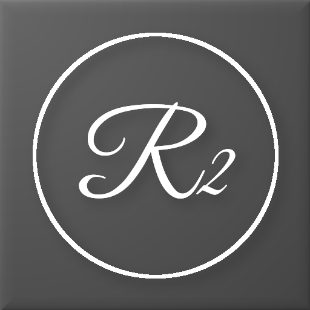
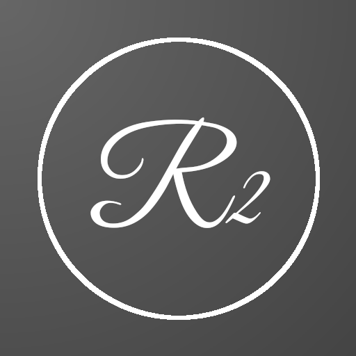
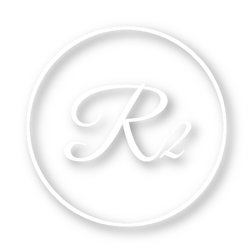

# RuthAndRoth Logos

The Jan 2020 'R2' logo is a refresh of Shin Ingen's original Ruth 2.0 logo
of the text 'R2' in a circle.  The update changes the typeface of the text
to reduce the amount of degradation seen when scaling the logo smaller.

The source in Gimp XCF format and a basic set of variants are included here
for easy use.

## Usage

The 'R2' logo is used to indicate projects or products that are either based on
or compatible with the RuthAndRoth project mesh bodies.  The RuthAndRoth project
has chosen to use the grey background for its branding, other creators are free
to adapt the coloring to their own needs.

### OSGrid

A box containing full-perm textures of the logo is available in the
[RuthAndRoth sim](hop://login.osgrid.org/RuthAndRoth/153/109/21)
at hop://login.osgrid.org/RuthAndRoth/153/109/21.

### Second Life

A box containing full-perm textures of the logo is available in the
[Serie-ous Style store](http://maps.secondlife.com/secondlife/Fireheart/240/229/1201).

### Github

The logo source file and some variants are located on Github in the
[RuthAndRoth Extras repo](https://github.com/RuthAndRoth/Extras/tree/master/Textures/Logo).

## Construction Details

The logo uses the [Great Vibes](https://fonts.google.com/specimen/Great+Vibes)
typeface designed by Rob Leuschke from [typeSETit](http://www.typesetit.com).
It is available under the
[Open Font License](http://scripts.sil.org/cms/scripts/page.php?site_id=nrsi&id=OFL_web)
at a number of font download sites, including
[Google Fonts](https://fonts.google.com/specimen/Great+Vibes) and
[Adobe Fonts](https://fonts.adobe.com/fonts/great-vibes).

The logo is drawn as follows:

* The circle is 80% of the 512x512 image size and centered
* The 'R' is at 192 pt (30% of the image size), the '2' is at 128 pt
  (25% of the image size), is centered horizontally and is 20 px below
  center vertically
* A 10x10 px drop-shadow to lower-right is applied in black at 50%
  opacity to both the circle and 'R2' text.
* The background uses a partial radial gradient in grey (#666666 -
  #444444) with the light side centered on the upper-left corner to
  match the drop-shadow.
* A 25 px bevel is applied to the background

## Images

The pre-exported logo images are named following this pattern:

    r2-logo-<foreground-color>-<background-color>-<extra>.png

where `<extra>` is anything needed to distinguish additional characteristics
such as `flat` (without drop shadows).

   

* r2-logo-white-grey.png - The default version with bevel and shadows
* r2-logo-white-grey-flat.png - A flat version without the background bevel
  or drop shadows
* r2-logo-black-alpha.png - Suitable for placing over any light background
* r2-logo-white-alpha.png - Suitable for tinting in-world to put over
  any background

## Original Logo

The original logo appears to have used [Chopin Script]
(https://www.1001freefonts.com/chopin-script.font) or one of its'
close relatives.  The thin lines tended to disappear or degrade
when scaled
